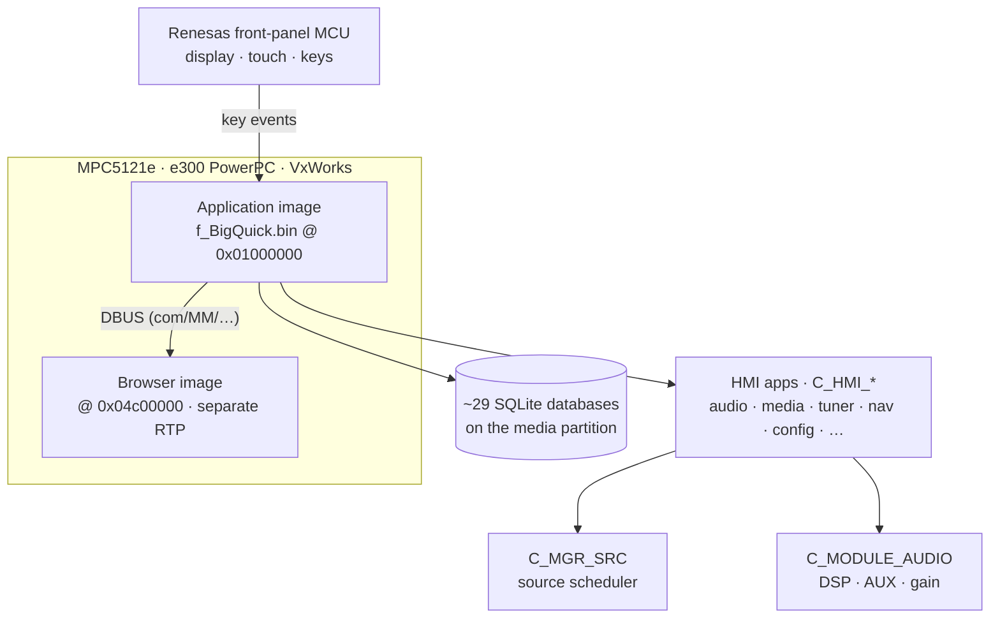

# Architecture

How the SMEG+ firmware fits together. Addresses are for the **AUDIO_BT**
(`SMEG5.43.A.R2`) image unless noted; the NAV build is the same code plus navigation,
and has its own symbol map.

!!! note "How these findings were obtained"

    Read-only analysis of the owner's own upgrade package: the shipped absolute
    symbol maps, string tables in the images, code disassembly (PowerPC, via
    capstone), and byte inspection of the manifests. Anything inferred rather than
    observed is marked. See the [analysis notes](ANALYSIS.md) for the image format itself.

## 1. System shape

- **VxWorks** RTOS on a **Freescale MPC5121e** PowerPC SoC — an **e300** core, which is
  plain 32-bit big-endian PowerPC with no vendor instruction set extensions. That is why
  the shipped image can be executed on a desktop; see
  [Emulating the firmware](EMULATION.md). The part number comes from
  [bousqi/SMEG_PLUS](https://github.com/bousqi/SMEG_PLUS), which also documents the
  U-Boot/VxWorks side and the TFFS partition layout.
- Alongside it, a **Renesas** front-panel MCU (display / touch / audio-adjacent) and a
  **Blackfin/Maxim** DAB chipset.
- The HMI is a custom C++ framework (`C_HMI_*`) over **Qt** middleware, with an
  embedded **WebKit** browser in a separate loadable image.
- Modules talk over **DBUS** (`com/MM/...` interfaces) via generated
  `C_BCM_*_SERVER` / `C_BCM_*_CLIENT` pairs.
- Persistent state lives in ~29 **SQLite** databases on the media partition.

At a glance, the pieces and how they talk:



## 2. Code regions ("modules")

Each module is a linked image with an `InitializeMeta<Mod>` entry and a chain of
`InitializePkg<Component>` initialisers:

| region | base | size (extent) | symbols | what |
|---|---|---|---|---|
| `abs_symbols_base` | `0x01000000` | → `0x02fc1120` | 82 110 | **AUDIO_BT application** (`AppBin/f_BigQuick.bin`, ~32 MB) |
| NAV map | `0x01000000` | → `0x0377d624` | 98 365 | **NAV application** (same code + navigation, ~40 MB) |
| `abs_symbols` | `0x04c00000` | → `0x05a8979c` | 7 290 | **"Post" / WWW browser image** (~14 MB, separate RTP) |
| `symbols_bsp` | offsets | — | 22 497 | **VxWorks kernel + BSP** |

Initialisers in the application image:

```
0x01000000  InitializeMetaAudioBt()      (NAV: InitializeMetaNav())
0x010001c4  InitializePkgAppliBoot()
0x01158b00  InitializePkgCoreMw()        core middleware
0x0197d458  InitializePkgQtMw()          Qt middleware
0x0197d770  InitializePkgCoreHmi()       HMI core
0x0202f34c  InitializePkgBt()
0x0202f528  InitializePkgPostMw()
```

The `0x04c00000` image is the **embedded browser**: `InitializeMetaPost()`,
`InitializePkgWWW()`, `main_hmi_internet`, `C_HMI_INT_APP_BASE`, `C_BCM_Browser`,
`C_BCM_BROWSER_SERVER` (exposes `DBUS_ReadTime/ReadTripData/ReadInstSpeed/ReadUnits/
ReadCurrentCoordinates/…` so the JS bridge can read car data), plus the Qt/WebKit and
`C_Addon_*` JavaScript bridge. It is a **separate process** that talks to the main
image over DBUS.

## 3. HMI framework

### Application entry points

Each HMI application is a module thread started from a `main_hmi_*` routine, with a
matching `C_HMI_*_APP_BASE` class:

| app | entry | base class |
|---|---|---|
| audio | `main_hmi_audio` | `C_HMI_AUDIO_APP_BASE` |
| desktop | `main_hmi_desktop` | `C_HMI_ClientDesktopFsm` |
| media | `main_hmi_media` | `C_HMI_MEDIA_APP_BASE` |
| picture | `main_hmi_picture` | `C_HMI_PICTURE_APP_BASE` |
| tuner | `main_hmi_tuner` | `C_HMI_TUNER_APP_BASE` |
| video | `main_hmi_video` | `C_HMI_VIDEO_APP_BASE` |
| config | `main_hmi_config` | `C_HMI_CONFIG_APP_BASE` |
| climate | `main_hmi_climate` | `C_HMI_CLIMATE_APP_BASE` |
| drive | `main_hmi_drive` | `C_HMI_DRIVE_APP_BASE` |
| bluetooth | `main_hmi_bt` | `C_HMI_BT_APP_BASE` |
| upgrade | `main_hmi_upgrade` | `C_HMI_UPGRADE_APP_BASE` |
| navigation *(NAV)* | `main_hmi_navi` | `C_HMI_NAV_APP_BASE` |
| internet *(Post)* | `main_hmi_internet` | `C_HMI_INT_APP_BASE` |

Every base shares the lifecycle body `Initialize() / InitApp() / Body() /
PreHold() / PostHold() / Backup() / PostponedInit() / Finalize() /
module_registration() / RegisterMenu() / Instance()`, which is the signature of the
framework's module-thread base.

### Module thread — `C_HMI_ModuleThread`

Owns the app's timers and its menu objects (`menu ctors take a C_HMI_ModuleThread*`):
`Body()`, `Initialize()`, `StartTimer(ulong,ulong)`, `Init(bool,bool)`.

### Event handler — `C_HMI_EventHandler`

The single message bus. Modules register and subscribe to a set of
`C_HMI_BaseMessage::t_types`; `main_loop(t_loop_type)` dispatches typed messages:

```
AddModule(ulong) / RemoveModule(ulong) / AddModuleToEventList(ulong, vector<t_types>&, ulong&)
DispatchEHMessage(C_HMI_BaseMessage*)   + one overload per subtype:
  InternetEvent  InternetConfig  GUIConfiguration  ToVideo  FromVideo
  Nav  Upgrade  Touch  Keyboard  System
```

This is the path taken by the AUX notification described in [The AUX chain](AUX_CHAIN.md).

### Screens and menus — `C_HMI_MENU_MGR` / `C_MENU_STATE`

`C_HMI_MENU_MGR` is owned by a module thread. Screens are registered by id and the
menu tree comes from `desktopServices.sqlite` (`current_menu`, `current_carrousel`):

```
RegisterScreen(unsigned short id, C_MENU_STATE* state)
GetMenuStatePointer / GetCurrentActiveScreenId / CloseMenuTree / UnregisterAllScreens
C_MENU_STATE::GetState / GetScreenId / GetScreenType / GetCurrentMenuId / GetRootItemId
```

Worked example (see [Cheatcodes](CHEATCODES.md)): the Config app constructs
`C_HMI_CONFIG_EngineModeCheatCode_VKB_Z1` and calls
`C_HMI_MENU_MGR::RegisterScreen(0x5601, state)` — screen id 22017, which the menu
database also references.

## 4. Messaging

`C_HMI_BaseMessage` with concrete subclasses: `C_HMI_PrivateMessage`,
`C_HMI_KeyboardMessage`, `C_HMI_TouchMessage`, `C_HMI_SystemMessage`,
`C_HMI_TimeOutMessage`, `C_HMI_DBusMessage`, `C_HMI_HotKeyMessage`,
`C_HMI_ToVideoMessage` / `C_HMI_FromVideoMessage`, `C_HMI_NavMessage`,
`C_HMI_UpgradeMessage`, `C_HMI_Internet*Message`, `C_HMI_GUIConfigurationMessage`.

- **Keyboard** — `GetVKeyPressedData`, `GetVKeyReleasedData`, `GetVKeyRepeatData`,
  `GetVKeyKeepPressedData` (long press), `GetVKeySimultaneusData` (chords). This is
  the hardkey trigger surface.
- **Touch** — a large family: click/double-click/long-click/keep-pressed/released,
  drag/drop, slider bounds, list notifications, coverflow, checkboxes, rosace…
- **Hotkeys** — delivered as `C_HMI_HotKeyMessage`, consumed by each app's
  `HandleHotKeyMessage`.

### DBUS

`C_DBUS_INTERFACE` (init/registration, `CatalogueDBus`), the client factory
(`C_DBUS_Client_Factory`, `C_DBUS_ClientInstantiate`, `SendMessage(ulong)` to post an
HMI event id), and generated interfaces. Both sides are paired:
`C_BCM_X_SERVER` exposing `DBUS_*` remote methods and `C_BCM_X_CLIENT`.
Confirmed servers include DB manager, UP (user profile), KIM (key interface),
tuning, parking, failsoft, browser, connectivity.

## 5. Subsystems

- **Source manager `C_MGR_SRC`** — the audio-source scheduler. Permanent vs temporary
  sources (`MGR_SRC_PNormal_t`), scheduler positions (`MGR_SRC_SchedulPos_t`),
  `AllocateSource` / `ReleaseSource` / `AddRequest` / `ExecuteAllocation` /
  `ForceSchedulerPosition`, and `ReadSupervisorData()`. Mirrored one-for-one on the
  server (`C_SRV_AUDIO_SERVER`) and HMI client (`C_BCM_HMI_AUDIO_CLIENT`:
  `ActivateSourceByID`, `ActivateSourceByType`, `ActivateNextSource`, …).
- **Audio module `C_MODULE_AUDIO`** — DSP/mixing/amplifier owner; source switching,
  AUX status and gain, mute management. Detail in the [analysis notes](ANALYSIS.md).
- **Tuner `C_MODULE_TUNER`** + radio front-end `C_I2C_SMART_RADIO` (RDS/AF/DAB, and
  `Get_AUX_signal_status`).
- **Key interface `C_BCM_KIM`** — turns front-panel/AVR key events into HMI keyboard
  messages and desktop destinations (`SendKeyEvent`, `RegisterAsDestination`).
- **Desktop / shell `C_HMI_ClientDesktopFsm` + `C_BCM_DesktopServices`** — the
  carrousel and status bar, welcome/eco/dark screens, popups; menu tree from
  `desktopServices.sqlite`.
- **Bluetooth** — `C_HMI_BT_APP_BASE`, `BTAudioSupervisorTask`, audio profiles;
  related network-audio classes (`NetworkAudio_SERVER`).
- **Failsoft `C_BCM_FAILSOFT_SERVER`** — `RebootSystem`, hold/resume, fault flags.
- **Video bridge `C_GUI_VideoServiceModule`** — Qt/QWS ↔ HMI event handler.

## 6. Data — SQLite databases

29 databases ship in the media partition. The application reaches them through
`C_BCM_DB_MANAGER_SERVER` (`get_database_path`, `save_database`,
`database_corruption_detected`) and `C_BCM_UP_SERVER` for the `up_*` settings stores.
`db_manager.sqlite` is the registry of every database and its persistence policy.

| group | databases |
|---|---|
| configuration / reference | `config`, `config_options`, `versions`, `version_history`, `db_manager`, `upgrade`, `cheatcodes`, `RadioLogo`, `tuner`, `media_catalog`, `media_cdc_catalog`, `media_jkb_catalog`, `nav_poi` |
| user / runtime | `up_common`, `up_config`, `up_user`, `up_user_hmi`, `agenda`, `KeyboardHistory`, `Pictures`, `browser`, `connectivity`, `Trip`, `navigation`, `nav_dest`, `diagnosis`, `diag_zi`, `db_alerts` |
| desktop | `desktopServices` (`current_menu`, `current_carrousel`, `persistent_menu`) |

The `up_*` stores share one generic typed key/value table
(`UP_Keys(Section,Name,Type,Idx,IntValue,FloatValue,StringValue,BlobValue,…)`) — this is
where per-source audio defaults such as `AUX / Vol_aux` live.

## 7. Resources

GUI text/sounds, the ring tone and wait tone WAVs, cheatcode libraries, symbol maps,
fonts and radio logos all live in the media partition and are described in
[Media partition](MEDIA_PARTITION.md). The graphical skin is delivered by the separate
`HARMONY` module (`BigHarmony_1..5`), selected per vehicle/zone via the
`*.bigharmony.ini` mapping files.

## 8. Open questions

- Which on-disk file supplies the `0x04c00000` browser image (not contained in the
  application image).
- Whether HMI apps are threads in one process or separate processes (the naming implies
  threads; no explicit task table was found).
- Exact semantics of the `CheckType` byte (0–3) in the `*_ctrl.bin` manifests — see
  [Boot & update chain](FLASH_CHAIN.md).
- The `AUDIO_AUX_SIGNAL_STATUS_CHANGED` vs `AUDIO_AUX_INPUT_STATUS_CHANGED` question —
  see [The AUX chain](AUX_CHAIN.md).
