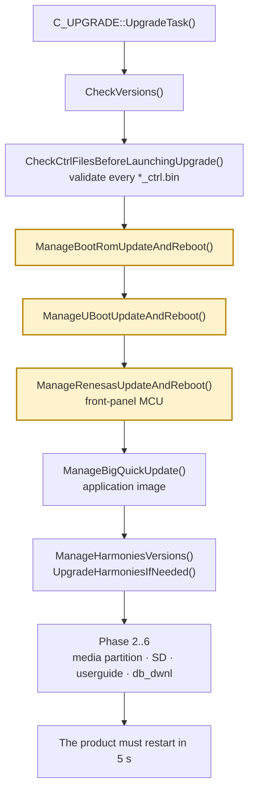
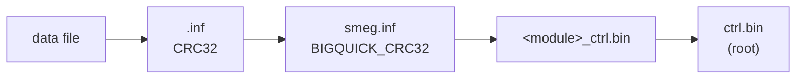
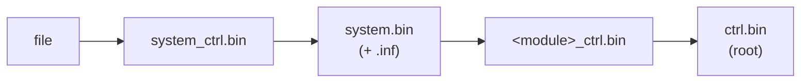

# Boot and update chain

What boots the unit, what the USB updater does, and in what order. Derived from the
package layout, the byte structure of the manifests, and the human-readable message
strings inside `upgrade.out` (an unstripped PowerPC ELF).

## 1. Flash layout

`BSP/SMEG_PLUS_<variant>/flasher.inf` is three fields per line — **path, address,
CRC** (the updater logs `(ReadField_InFlasherInfFile): Field: '%s', Path = '%s',
Address = '0x%X', CRC = '0x%X'`):

```
BSP/SMEG_PLUS_512/flasher.inf
  SMEG_PLUS_UPG/BSP/SMEG_PLUS_512/vxWorks.bin   0x720000  71242c66
  SMEG_PLUS_UPG/BSP/SMEG_PLUS_512/dbsystem.bin  0x180000  215167f7

BSP/SMEG_PLUS_256/flasher.inf
  SMEG_PLUS_UPG/BSP/SMEG_PLUS_256/vxWorks.bin   0x420000  731ae273
  SMEG_PLUS_UPG/BSP/SMEG_PLUS_256/dbsystem.bin  0x180000  718c41b5
```

| image | 256 build | 512 build |
|---|---|---|
| `vxWorks.bin` (RTOS) | `0x420000` | `0x720000` |
| `dbsystem.bin` | `0x180000` | `0x180000` |

**256 vs 512** is the NAND/board size, not a firmware feature level. The two BSP trees
differ only in the `vxWorks.bin` image and its address; the updater selects a tree from
the hardware type (`GetHWType`, `SMEG_PLUS_256/` vs `SMEG_PLUS_512/`) and the 256 units
use the dedicated relauncher `upgrade_256.out` ("Relaunch For 256"). This package ships
both, with the root `flasher.inf`/`flasher.crc` mirroring the 512 variant.

### `dbsystem.bin` — the 40-byte vxWorks descriptor

Despite being tiny, it is meaningful. The updater logs:

```
VxWorks.bin parameters in dbsystem are (size: %d ==? %d, crc: 0x%X ==? 0x%X, Nb blocks = %d)
```

and it embeds the matching `vxWorks.bin` CRC32 (`71242c66` for 512, `731ae273` for
256), plus a leading byte equal to the top byte of the load address (`0x72` / `0x42`).
So it is the **size / CRC / block-count descriptor** used to cross-check `vxWorks.bin`
before flashing. Exact per-field offsets are not yet pinned down.

### Other BSP files

- `flasher.crc` is the CRC32 of `flasher.inf` (confirmed: the value equals the CRC the
  root manifest records for `/flasher.inf`).
- `BSP/SMEG_PLUS_<variant>_ctrl.bin` lists exactly the six BSP files.

### Front-panel MCU

`RENESAS/FPComSMEG.mot` is **Motorola S-record** (starts `S0` "start>", then `S2`/`S3`
records), version `05.e3.01`, with two LVDS configuration words
(`RENCONF_1_LVDS`, `RENCONF_2_LVDS`). Flashed by `ManageRenesasUpdateAndReboot`.

## 2. The updater

`upgrade.out` / `upgrade_256.out` (entry modules) with `upgrade_lib.out` and
`UpgPlugin.out` (plugin). The sequence, from symbol names plus emitted messages:



The `Manage*AndReboot` steps (highlighted) each reboot the unit so the new low-level code
runs on the next pass. Reading the same flow from the symbols and message strings:

```
C_UPGRADE::UpgradeTask()
  LaunchUpgrade()
    CheckVersions()
    CheckCtrlFilesBeforeLaunchingUpgrade()      validate every *_ctrl.bin
    ManageBootRomUpdateAndReboot()              BSP
    ManageUBootUpdateAndReboot()                U-Boot
    ManageRenesasUpdateAndReboot()              front-panel MCU
    ManageBigQuickUpdate()                      application image
    ManageHarmoniesVersions() / UpgradeHarmoniesIfNeeded()   UI skins
    Phase 2..6                                  media partition, SD, userguide, db_dwnl
```

It emits `=== PHASE %d ===>>> End : %ld seconds` markers and finishes with
`<<<<<<< The product must restarting in 5 s >>>>>>>`. The `Manage*AndReboot` naming
indicates the unit reboots after the BootROM, U-Boot and Renesas steps so the new
low-level code runs next.

### Skip gates (why a re-flash is usually small)

```
manageBootRomUpdateAndReboot: BootRom already done.
ManageRenesasUpdateAndReboot: Renesas version '%s' == Mot. File version '%s'   -> skip
```

So on an already-current unit, the boot ROM and the MCU are skipped and only the parts
whose content differs are written.

### The application image

```
ManageBigQuickUpdate: '%s' is a cantidate!
ManageBigQuickUpdate: WriteNANDBigQuick ('%s').
VerifyNANDBigQuick : CRC of data BigQuick is NOK / WriteNANDBigQuick - CRC on source file / CRC on the flash
```

It scans `AppBin/`, rejects non-binaries, and treats a file as a **candidate when its
checksum differs from what is stored**. It then writes and reads back to verify. If the
running BSP is too old to expose `WriteNANDBigQuick` it refuses
(`Error loading symbol WriteNANDBigQuick, it's an old BSP!!!`,
`BSP Not compatible. Please use the loader button...`).

This is why a patched `f_BigQuick.bin` (different content ⇒ different CRC) is rewritten
even though the version *string* is unchanged.

### Harmony (UI skins)

`ManageHarmoniesVersions` compares versions — `Harmonies are compatibles` or
`Harmonies are not compatibles, new Harmony must be erased` — and `EraseNandHarmony` is
a dynamically-resolved BSP symbol. `UpgradeHarmoniesIfNeeded` runs four steps: save the
harmony offset from `Harmony.ini`, erase all harmonies, manage the ones on the stick,
then write them. Images are read/written with bad-block handling.

**Resolved since this was first written:** the `SIZE:` / `SIZE_1..SIZE_32` fields are
computable — `SIZE` is the sum of the file sizes inside the tar and `SIZE_n` the same with
each file rounded up to *n* KiB. They are read by `UpgPlugin.out` for the media space check.
See [Media partition](MEDIA_PARTITION.md#the-size-fields-solved).

### Version gates

```
(UpgradeTask) The version on media.inf not allows an upgrade
Upgrade not possible / Upgrade not possible!! value is too high
(GetUBootVersionMedia): field 'VER:' not found!
```

`media.inf` carries `VER:26482` (the "CD / media version") and is a **hard gate** — see
[Version strings](VERSION_STRINGS.md). Versions also drive the U-Boot
(`%02d.%02d`) and harmony/BSP decisions, which is why inventing a version is risky.

## 3. The package ships its own symbol tables

`upgrade.out`, `UpgPlugin.out` and `upgrade_lib.out` in the package root are **unstripped
PowerPC ELF objects**. They are not the head-unit application — they are the updater
itself, the code that runs from the stick — and they carry full symbol tables:

| file | functions | what it is |
|---|---|---|
| `upgrade.out` | 2171 | the updater; `C_UPGRADE` alone has **117 methods** |
| `UpgPlugin.out` | ~440 | the plugin the application talks to, including `C_UPG_LOGS` |
| `upgrade_lib.out` | ~250 | shared helpers |

So the flow on this page, which was originally recovered by matching log strings, can be
read directly:

```sh
uv run tools/elfsyms.py SMEG_PLUS_UPG/upgrade.out --class C_UPGRADE
uv run tools/elfsyms.py SMEG_PLUS_UPG/upgrade.out --grep ZA
uv run tools/elfsyms.py SMEG_PLUS_UPG/upgrade.out --strings Phase
```

A few names worth knowing they exist, because they answer questions asked elsewhere in
these docs:

| symbol | why it matters |
|---|---|
| `C_UPGRADE::UpgradeTask` `0001f348` | the whole sequence; every `Phase N` is set from here |
| `C_UPGRADE::ManageZAFiles` `0000fd04` | Phase 6 — see [Hardware verification](VERIFICATION.md) |
| `C_UPGRADE::SaveDataOnUSB` / `RestoreDataFromUSB` | the `USER_DATA` round trip a `user_data` payload lands in |
| `C_UPGRADE::ManageSQLiteFiles` `0000d5ec` | the settings databases |
| `C_UPGRADE::ManageBigQuickUpdate` `00016f04` | where the application image is written |
| `C_UPGRADE::UpgradeOneHarmony` / `CheckHarmonyIntegrity*` | the HARMONY skin handling |
| `C_UPGRADE::LogsOnTelnet` `000075a4` / `MakeLogArchive` `000077b8` | where the updater's own logs can go |
| `C_UPG_LOGS::Instance` (in `UpgPlugin.out`) | the logging singleton on the application side |

### The BSP image has a symbol table as well

`BSP/SMEG_PLUS_512/vxWorks.bin` is not an ELF — it is a raw PowerPC image that begins with
a function prologue at offset 0 — but it carries a **VxWorks symbol table** near the end.
The entries are 20 bytes: a pointer to the name, then the address.

It loads at **`0x00200000`**, and that is not a guess. Read at that base the table's name
pointers resolve to readable strings, and the application's own call into the kernel at
`0x0058c248` — the one `IsAUXSRCAvailable()` makes on its failure path — is named `tickGet`
by the table at exactly that address. The application and the kernel therefore share one
address space, which is what makes a branch from the application into a kernel function
possible at all; `patches/diagnostic-logsink.json` relies on it.

`tools/elfsyms.py` does not read this format — it is not ELF. Recovering a symbol means
finding its name in the table and taking the word after the name pointer.

### The phases

Seven phase strings exist, `Phase 0` … `Phase 6`, all set through
`C_UPGRADE::SetCurrentPhase()` from `UpgradeTask`. The action line beneath comes from
`SetCurrentAction()`. Grouping the action strings by where they sit between the phase
strings in the literal table gives:

| phase | actions |
|---|---|
| 0 | `formatting /SYSTEM`, `defragmenting /SYSTEM_DATA`, `Uncompress /SYSTEM_DATA`, `Manage /SYSTEM_DATA/ in final customer mode`, `defragmenting /USER_DATA`, `defragmenting /USER_DATA_BACKUP` |
| 1 | — |
| 2 | — |
| 3 | `Manage /SYSTEM/ in final customer mode`, `Uncompress /SYSTEM`, `Check the result of uncompression of /SYSTEM/` |
| 4 | — |
| 5 | `Uncompress /SD_DIR`, `Uncompress /SD_DIR_TTS`, `Check the result of uncompression of /SD_DIR/` |
| 6 | `Management of UserGuide`, `Management of ZA files` |

!!! warning "The grouping is inferred; the strings and the phase count are not"

    That the seven phases exist, that they are set from `UpgradeTask`, and the exact
    wording of every action line are all read straight out of `upgrade.out`. Which action
    belongs to which phase is inferred from the **order of the literals in the string
    table**, which usually follows source order but is not a guarantee. Phases 0, 3, 5 and
    6 are corroborated by photographs of a real update; 1, 2 and 4 have not been seen on
    screen and may be skipped for this hardware, this package, or both.

Phase 6 ends with `The product must reboot in 2 s` — the reboot at the end of an update is
that phase finishing, not a spontaneous restart.

## 4. The manifest cascade

Every checksum feeds the one above it, so a single changed byte ripples all the way to the
root `ctrl.bin`:



Inside the media partition it is one layer deeper — the per-file CRC in `system_ctrl.bin`
sits below `system.bin`:



`tools/patch_smeg.py` rebuilds this whole cascade after a write; see
[Media protection](MEDIA_PROTECTION.md) for how the same edit ripples through the signed
contract's records.

### `*_ctrl.bin` format

```
"19/09/2017  2.1.0.0"      generation date + manifest format version, padded
<count>                    1 byte (ctrl.bin = 0x13 = 19, USERGUIDE = 0x1E = 30,
                                    BSP_512 = 0x06 = 6, NAV = 0x13)
<count> x { CheckType(1 byte), CRC32(4 bytes big-endian), path(NUL-padded) }
```

Confirmed by byte inspection: the record for `/BSP/SMEG_PLUS_512/dbsystem.bin` is
preceded by `02 21 51 67 F7`, i.e. `CheckType 2` + the CRC `0x215167F7`; the
`vxWorks.bin` record carries `0x71242C66`. The updater logs
`CheckEntryFile : CheckType = 0 / 1 / 2 / 3 / unknown for file %s`, so the first byte is
the check type. `flasher.crc` is the CRC32 of `flasher.inf`.

`SD_DIR_TTS.crc` uses a different, textual scheme (`NUMBERFILES:394`, `CRC16:2305`).

## 5. `contract.dat` — the media contract

A 29 696-byte blob at the package root: 116 RSA-OAEP blocks holding a table of per-file
checks (size, crc32, and a content spot-check). It is **not** in the root manifest and
`upgrade.out` does not reference it, but the **application image** reads it in
`C_BCM_UPGRADE::CheckTrustedSource()` and validates the rest of the media against it.

A package with a modified application image is rejected with *"The update file is protected
and cannot be copied."* unless the contract is regenerated — the format is decoded and
`tools/patch_contract.py` does exactly that. See
[Media protection](MEDIA_PROTECTION.md).

## 6. Open questions

- Exact field offsets inside `dbsystem.bin`.
- `CheckType` semantics for values 0–3.
- Which module a given unit selects at runtime (`AUDIO_BT` vs `_256` vs `NAV`) — read
  from the vehicle/hardware type, not traced.
