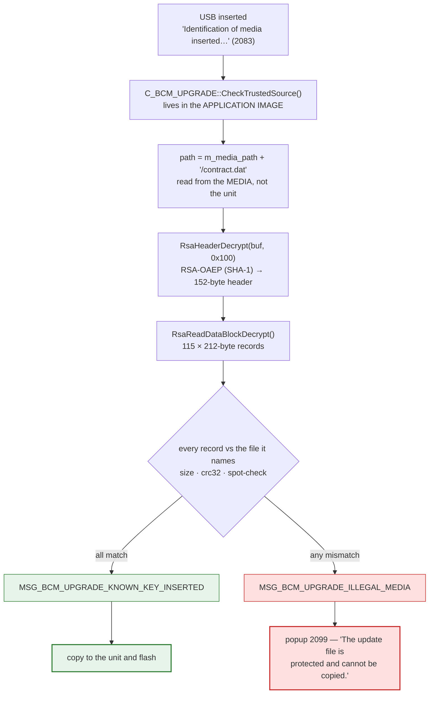
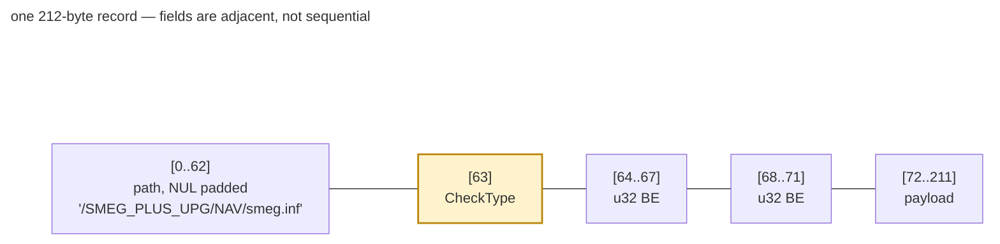
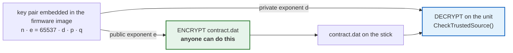
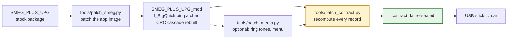
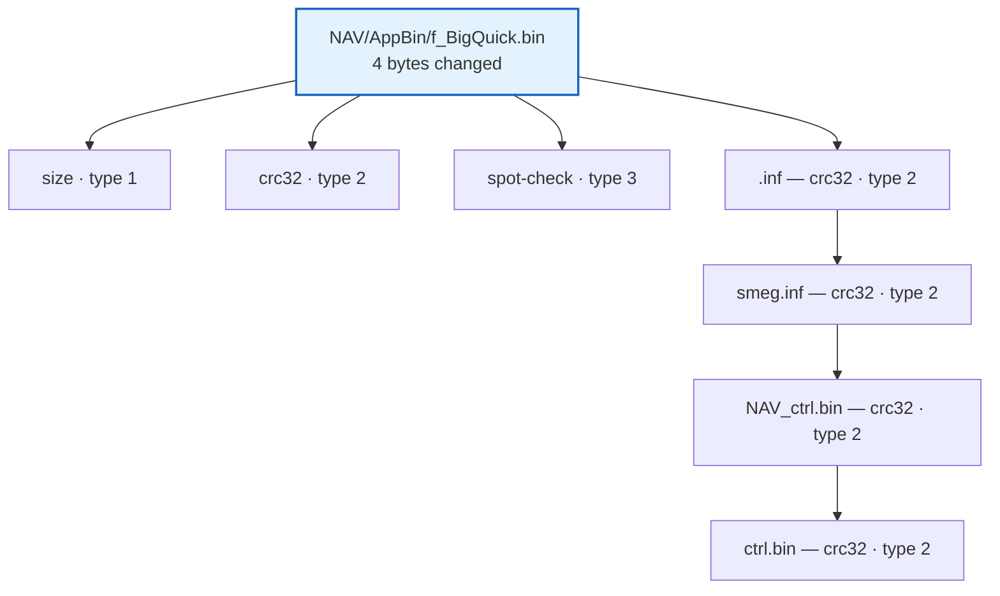

# Media protection: the contract, and how to re-seal a modified package

!!! success "Solved — a patched package can be re-sealed"

    The unit refuses modified firmware because it validates the media against a signed
    contract. That contract is **fully decoded**, and
    [`tools/patch_contract.py`](../tools/patch_contract.py) regenerates it from the
    files in your package.

    Workflow:

    ```sh
    python3 tools/patch_smeg.py     --src SMEG_PLUS_UPG --out SMEG_PLUS_UPG_mod
    python3 tools/patch_contract.py --package SMEG_PLUS_UPG_mod
    ```

    Verified on a real package: all 115 records recompute to exactly the values the
    original contract holds, and after patching the application image the regenerated
    contract decrypts cleanly and matches every file.

    **Confirmed on hardware.** A re-sealed patched package was accepted by a real unit —
    string 2099 did not appear, and the update went on to write the application image. See
    [Hardware verification](VERIFICATION.md).

## The symptom

Patching `AppBin/f_BigQuick.bin` and flashing the result gives **string id 2099**:

> The update file is protected and cannot be copied.

That is not a copy failure. It comes from the contract check.




## Where the check lives

```
C_BCM_UPGRADE::CheckTrustedSource(C_BCM_UPGRADE*)      @ 0x0187775c
```

The messages it logs name the mechanism:

```
(C_BCM_UPGRADE) CheckTrustedSourcetype +
(C_BCM_UPGRADE) CheckTrustedSourcetype : File path is '%s'
(C_BCM_UPGRADE) CheckTrustedSourcetype : Offset is %lu
(C_BCM_UPGRADE) CheckTrustedSourcetype : Size is %lu
(C_BCM_UPGRADE) CheckTrustedSourcetype : value_to_check is %lu
(C_BCM_UPGRADE) CheckTrustedSourcetype open Crypto file Succed
(C_BCM_UPGRADE) CheckTrustedSourcetype : l_array_contract_data is null
(C_BCM_UPGRADE) CheckTrustedSourcetype : Send message MSG_BCM_UPGRADE_KNOWN_KEY_INSERTED
(C_BCM_UPGRADE) CheckTrustedSourcetype : Send message MSG_BCM_UPGRADE_ILLEGAL_MEDIA
```

The flow:

```
CheckTrustedSource()
  path = m_media_path + "/contract.dat"          # read from the MEDIA, not the unit
  RsaHeaderDecrypt(buf, 0x100)   -> 152 bytes (0x98) into this+0x22c
  RsaReadDataBlockDecrypt(...)   -> 212-byte (0xd4) records into this+0x2c4
  compare each record against the file it names
  pass -> MSG_BCM_UPGRADE_KNOWN_KEY_INSERTED
  fail -> MSG_BCM_UPGRADE_ILLEGAL_MEDIA          # the user sees 2099
```

There is also an abort path: if `m_abort_contract_checking` (this+`0x1d3`) is non-zero the
check is skipped and the media treated as trusted. That flag is only set from
`C_BCM_UPGRADE::HandlePrivateMessage`, gated on internal phase state
(`C_CONTEXT_DYNAMIC_DATA::Get(0x4651, …)`), so it is not a usable route — and it would not
help anyway, because the check runs before anything is copied.

## The format

`contract.dat` is a multiple of 256-byte RSA blocks. **Each block is RSA-OAEP
(SHA-1) encrypted, then raw-RSA'd with the private exponent.**

```
block 0        header, 152 bytes
                 [0..8]   "19/09/2017"
                 [10..]   manifest version, "1.1.0.0"
                 [46..49] constant 0x7335cf08
                 [50..57] magic: deadbeef badef00d

blocks 1..N    one 212-byte record per checked file
                 [0..62]   path, NUL padded (e.g. "/SMEG_PLUS_UPG/NAV/smeg.inf")
                 [63]      CheckType
                 [64..67]  uint32 BE
                 [68..71]  uint32 BE
                 [72..]    payload
```



| CheckType | @64 | @68 | @72 | verified |
|---|---|---|---|---|
| 1 | `0xfffefffe` | `0xfffefffe` | file **size**, u32 BE | ✅ 13/13 |
| 2 | `0xfffefffe` | `0xfffefffe` | file **crc32**, u32 BE | ✅ 84/84 |
| 3 | **length** | **offset** | **raw bytes** read from the file | ✅ 18/18 |

`0xfffefffe` is the "field unused" sentinel. All 115 records in a real contract were
checked against the files on disk — 84 CRC32s and 18 spot-checks matched exactly, which is
what confirms the reading.

The paths are rooted at `/SMEG_PLUS_UPG/` (the folder name on the stick), so
`/SMEG_PLUS_UPG/NAV/smeg.inf` maps onto `<package>/NAV/smeg.inf`.

## Why re-sealing works

The unit **decrypts** with a private exponent, so the contract was **encrypted with the
public key**. Encrypting with a public key needs no secret — and both key pairs are
embedded in the firmware image as plain decimal literals:

```
n  2048-bit modulus          (617 decimal digits)
e  65537
d  ~2048-bit private exponent (616 digits; 2045 bits, hence not exactly 2048)
p, q  1024-bit primes

n == p*q verified;  d*e == 1 mod lambda(n) verified
```

!!! warning "Key material is not published here"

    The values are deliberately **not** reproduced in this repository, and
    `patch_contract.py` does not hardcode them either — it extracts the pair from the
    `f_BigQuick.bin` **of the package you point it at**, i.e. from firmware you already
    own, and uses it for that package only. Nothing is written out.

    Publishing these values would be publishing a vendor signing key, which would enable
    forgery against any device sharing it. Keeping the tool self-contained avoids that.



So the seal is: recompute every record from the files on disk, rebuild the blocks, and
re-encrypt with the public key. Because OAEP is randomised, the ciphertext differs each
run — the unit only cares that it decrypts to the right plaintext.

## Workflow



!!! note "The re-seal step is not optional"

    Any change to a file the contract covers invalidates it. Skipping
    `patch_contract.py` means the unit shows 2099 and copies nothing.

`patch_smeg.py` edits the application image, which moves six records in a NAV package:

| path | type | before | after |
|---|---|---|---|
| `ctrl.bin` | 2 crc32 | `3ad598f2` | `d135ef35` |
| `NAV_ctrl.bin` | 2 crc32 | `20a63c9c` | `a0a0ac2d` |
| `NAV/smeg.inf` | 2 crc32 | `ee006c38` | `d54b9090` |
| `NAV/AppBin/f_BigQuick.bin` | 1 size | `00f9cfa0` | `00be2087` |
| `NAV/AppBin/f_BigQuick.bin` | 2 crc32 | `7763afe0` | `7c310f0f` |
| `NAV/AppBin/f_BigQuick.bin` | 3 spot 140@5159103 | — | re-read from the file |
| `NAV/AppBin/f_BigQuick.bin.inf` | 2 crc32 | `eb883558` | `3b663d37` |



A four-byte patch therefore moves **six** records — three on the image itself, then the
three manifest layers above it.

Note the **root `ctrl.bin` is covered too**, so a media-partition edit needs the same
treatment.

For type 3 the length and offset are left alone and the bytes are simply re-read from the
patched file — the same window the unit will compare, so no knowledge of *why* that offset
was chosen is needed.

## Limits

- The tool re-seals; it does not validate that a package is otherwise sane. A wrong patch
  is still a wrong patch.
- It needs the module's application image present (that is where the key lives).
- `contract.dat` keeps its size; the record count is not changed, so this only works for
  files the contract already lists.
- Only ever used on firmware you own. See the project `NOTICE.md` for the trademark and no-firmware statements.
